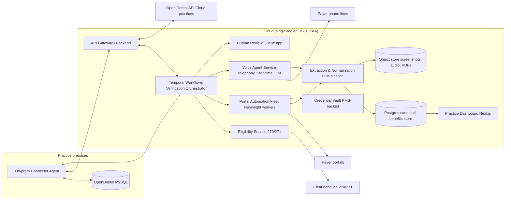

# Technical Design Document (TDD)

## AI Insurance Verification & Benefits Intelligence Agent ("NightShift")

| | |
|---|---|
| **Status** | Draft v1.0 |
| **Date** | July 2026 |
| **Companion doc** | `PRD-insurance-verification-agent.md` |
| **Team assumption** | 2 engineers + technical founder; 10–12 week MVP |

---

## 1. Design goals & constraints

1. **Durability over elegance.** Verifications are long-running (seconds → 45-minute phone holds), fail mid-flight, and must resume — the core abstraction is a *durable workflow*, not a request/response service.
2. **Provenance is a first-class datum.** Every extracted field must be traceable to a screenshot, an X12 segment, or a call-recording timestamp. No provenance → the field doesn't exist.
3. **Human-in-the-loop is an architectural tier, not an afterthought.** The review queue is a permanent component; automation rate grows by *moving work out of it*, measurably.
4. **The adversarial tax is budgeted.** Portals change, block, and challenge. Per-payer adapters are expected to break; detection, quarantine, and repair are designed-in.
5. **Small-team operability.** Boring, managed infrastructure. Two engineers must sleep. Anything exotic must justify itself against Temporal + Postgres + queues.
6. **HIPAA from commit one.** PHI boundaries drawn before the first integration, not retrofitted.

## 2. System overview



**Verification lifecycle (happy path):** connector syncs tomorrow's appointments → orchestrator plans per-patient verification (what's stale, what's needed for scheduled CDT codes) → eligibility ping (271) → portal adapter pulls breakdown → extraction pipeline normalizes to canonical schema with per-field provenance/confidence → writeback to OpenDental + dashboard → exceptions raised. Fallbacks: portal→voice→human queue.

## 3. Component design

### 3.1 On-prem Connector Agent
- **Why it exists:** most OpenDental installs are a local MySQL/MariaDB server on the office LAN; no inbound access. Cloud installs skip the connector (Open Dental API instead).
- **Form:** Windows service (the OpenDental server is a Windows box in practice), written in **Go** (single static binary, easy service install, low footprint). Auto-update via signed releases.
- **Duties:**
  - Outbound-only mTLS WebSocket/gRPC tunnel to cloud (no inbound ports).
  - **Read:** incremental sync of `appointment`, `patient`, `patplan`, `inssub`, `insplan`, `carrier`, `benefit`, `insverify`, `claimproc` (Phase-1 ERA reconciliation), using OpenDental's `SecDateTEdit`/audit columns for change detection; poll ≤60s.
  - **Write:** apply writeback commands (benefit rows, insplan note, `insverify` status, Commlog entry, patient Document PDF) through the **Open Dental API run locally where available, else guarded SQL** following OpenDental's documented conventions; every write wrapped in a reversible journal (before-image stored cloud-side).
  - **PHI minimization:** field allowlist; only sync columns the product uses.
- **Failure mode:** connector offline → cloud alerts practice + support; verifications proceed with last-synced schedule; writeback queues and drains on reconnect.
- **Key decision:** prefer Open Dental's official API surface wherever it covers a need (portability to Cloud, upgrade safety); direct SQL is the measured exception, register maintained per table with upgrade-compatibility tests against each OpenDental version we certify.

### 3.2 Verification Orchestrator (Temporal)
- **Why Temporal:** durable, resumable, observable long-running workflows with retries/timeouts/signals — exactly the shape of "verify 40 patients overnight across flaky portals and 30-minute phone holds." Self-hosted Temporal or Temporal Cloud (BAA available).
- **Workflows:**
  - `NightlyBatchWorkflow(practice)` — fan-out per appointment; deadline 7:00 AM local; prioritizes by appointment time and procedure value.
  - `VerifyPatientWorkflow(patient, appt)` — the state machine below.
  - `AdapterHealthWorkflow(payer)` — canary logins, drift detection (§3.4).
  - `ReconcileEobWorkflow(practice)` — Phase 1, ground-truth loop (§3.8).
- **`VerifyPatientWorkflow` states:** `PLAN → ELIGIBILITY → NEEDS_BREAKDOWN? → PORTAL → (fallback) VOICE → (fallback) HUMAN_REVIEW → NORMALIZE → QA_GATE → WRITEBACK → DONE / EXCEPTION`.
  - Planning rules: full breakdown required if plan new/changed, last full verification >30 days, high-value CDT scheduled (crown/SRP/implant families), or frequency-sensitive codes scheduled with unknown history. Else eligibility-refresh only.
  - `QA_GATE`: field-completeness + confidence thresholds decide auto-writeback vs. review routing.
- **Idempotency:** verification attempts keyed `(patient, plan, date)`; re-runs supersede, never duplicate.

### 3.3 Eligibility Service (270/271)
- Thin adapter over a clearinghouse API partner. **Evaluation (Week 2 spike):** Stedi (modern API, dental payer list), Onederful (dental-specific), DentalXChange (incumbent rails). Criteria: payer coverage vs. founder-clinic payer mix, real-time latency, BAA, per-transaction cost (~$0.10–0.35), sandbox quality. Abstract behind `EligibilityProvider` interface — expect to dual-source eventually.
- Parses 271 into canonical fields (coverage active, plan begin/end, some deductible/max data when payers populate it) with segment-level provenance.

### 3.4 Portal Automation Fleet
- **Runtime:** Playwright (Chromium) workers in hardened containers; one browser context per (practice, payer) session; session state (cookies) encrypted and reused to minimize logins/MFA.
- **Adapter model:** per-payer TypeScript modules implementing a common interface:
  ```
  PayerAdapter {
    login(ctx, creds): Session
    findMember(session, subscriber): MemberHandle
    fetchBreakdown(handle): RawCapture   // DOM snapshots + screenshots + downloaded PDFs
    capabilities(): FieldCoverageMap     // which canonical fields this payer exposes
  }
  ```
  Extraction is deliberately **not** in the adapter: adapters capture raw artifacts; the LLM pipeline extracts. This halves adapter maintenance (layout drift usually breaks selectors for *navigation*, not the meaning of captured pages).
- **Launch set:** 8–10 adapters chosen from founder-clinic volume (Delta state plan, MetLife, Cigna, Aetna, Guardian, UnitedHealthcare Dental, Humana, local BCBS, DNoA as candidates).
- **MFA/credentials:** practice-delegated credentials in the Vault (§3.6). MFA strategies per payer: TOTP (seed enrolled during onboarding — preferred), email-code (practice forwards a dedicated mailbox/alias we can read), SMS (provisioned VoIP number registered with the portal where allowed). Human-assisted MFA fallback routes to review queue.
- **Anti-blocking posture (deliberately conservative):** we are *not* evading — the agent uses the practice's own authorized credentials at human-plausible rates (rate-limited, business-hours-plus-overnight windows respecting portal maintenance windows), stable egress IP per practice region, honest automation posture. No CAPTCHA farms; CAPTCHA → session flagged → human-assisted unlock → engineering review of cadence. Per-payer ToS register (counsel-reviewed) drives per-payer posture, including "voice-only" designation for hostile portals.
- **Drift detection:** nightly canary run per adapter against a synthetic/staff member; structural-diff alarms; failed adapters auto-quarantine (workflows skip to voice/human) and page on-call. Target: adapter breakage → customer-invisible.
- **LLM-assisted repair (P1):** capture DOM at failure, propose selector patches for engineer review — repair-time reducer, not autonomy.

### 3.5 Voice Agent Service
- **Stack:** Twilio (SIP/programmable voice, BAA) → realtime speech pipeline (streaming STT → LLM policy → TTS, or a realtime speech-to-speech model where latency/cost allow; abstract behind `VoicePipeline`).
- **Call plan per payer:** IVR map (DTMF/speech sequence to reach benefits line, learned per payer and versioned like an adapter), hold detection (music/silence classifier — LLM idles during hold, cheap), rep-conversation script driven by a **structured slot-filling policy**: the agent works through the canonical field checklist, confirms values by read-back ("so two prophies per calendar year, correct?"), and never invents answers.
- **Guardrails:** the agent discloses automation + practice identity (PRD R12); domain-restricted (benefits questions only); on rep confusion/refusal or confidence drop → polite close, partial result, route to human queue (PRD R11). Max 2 attempts/patient/day.
- **Outputs:** full recording (object store, encrypted), diarized transcript, slot-filled draft breakdown with per-field timestamp provenance.
- **Concurrency economics:** calls are ~90% hold time; one orchestrating worker supervises many parallel calls; telephony+model cost target <$1.50/completed call at MVP, <$0.60 at scale (hold-time detection keeps LLM tokens near zero until a human speaks).
- **Recording compliance:** per-state consent policy table gates recording behavior (PRD §9); when in doubt, agent announces recording.

### 3.6 Credential Vault
- Envelope encryption: per-practice data keys wrapped by cloud KMS; secrets decrypt only inside portal/voice workers (short-lived leases, memory-only); full audit log of every credential access (who/which workflow/when).
- Credentials entered by the practice via the dashboard (write-only UI; support can never view). Rotation reminders; breach playbook documented.

### 3.7 Extraction & Normalization Pipeline
- **Input:** raw captures (DOM/HTML, screenshots, PDFs, 271 payloads, call transcripts). **Output:** canonical `BenefitBreakdown` (§4) with per-field `{value, source_ref, confidence, retrieved_at}`.
- **Method:** schema-constrained LLM extraction (structured outputs against the canonical JSON Schema), payer-specific few-shot exemplars, deterministic post-validators (numeric ranges, date sanity, cross-field rules like `used ≤ maximum`, CDT-range sanity). Two-pass consensus (independent extraction runs must agree per field, disagreement lowers confidence) for portal PDFs and transcripts — the two noisiest sources.
- **Confidence model:** starts heuristic (source type × validator pass × consensus agreement × payer historical accuracy), graduates to calibrated model once review-queue labels accumulate (§3.8).
- **LLM usage policy:** BAA'd, zero-retention endpoints only; PHI-minimized prompts (member IDs tokenized where the task allows); every prompt/response logged to the audit store (PHI-scoped) for QA replay.
- **Eval harness from week 1:** golden set of captures (founder clinic first) with human-verified field values; CI gate — extraction changes must not regress field-level F1; per-payer accuracy dashboards.

### 3.8 Human Review Queue & data flywheel
- Internal web app: work item = partial breakdown + raw artifacts side-by-side; reviewer fills/corrects fields; corrections stored as **field-level labels** `(payer, plan, field, model_value → human_value, artifact)`.
- Labels feed: extraction few-shots/evals, confidence calibration, adapter capability maps, and the payer-behavior corpus (the compounding moat asset).
- **Phase 1 — EOB ground truth:** `ReconcileEobWorkflow` joins posted `claimproc` adjudications against predicted benefits; mismatches become auto-labels (e.g., predicted 80% basic, paid 50% → downgrade or category error) and customer-facing accuracy reporting (PRD R25).

### 3.9 Dashboard & API
- **Frontend:** Next.js + TypeScript, hosted on the backend's infra (no separate platform); mobile-usable (front desk uses iPads).
- **Backend:** single modular service (**TypeScript/Node** — shared language with adapters/extraction glue; team-size-appropriate) exposing REST + webhooks; Temporal client embedded. Split into services only when scale forces it.
- **Multi-tenancy:** practice_id row-level scoping + Postgres RLS; tenant isolation tests in CI.

## 4. Data model (core)

```
practice(id, name, tz, plan_tier, opendental_mode[server|cloud], …)
connector(id, practice_id, version, last_seen_at, …)
payer(id, name, portal_domain, phone, ivr_map_version, tos_posture, …)
payer_plan(id, payer_id, group_number, employer_name, quirks_json, …)   -- the corpus
patient_link(id, practice_id, od_patnum, demographics_min, …)           -- PHI-minimized mirror
coverage(id, patient_link_id, payer_plan_id, subscriber_info, od_refs, …)
verification(id, coverage_id, appt_date, status[state machine], planned_scope,
             requested_by, deadline_at, completed_at, …)
verification_step(id, verification_id, kind[eligibility|portal|voice|human],
                  status, artifact_refs[], cost_cents, started/ended, …)
benefit_snapshot(id, verification_id, canonical_json,           -- full BenefitBreakdown
                 field_provenance_json, confidence_json, version, …)
exception(id, verification_id, type, severity, message, resolved_by, …)
writeback(id, verification_id, target[benefit|note|insverify|commlog|document],
          payload, before_image, status, reverted_at, …)
review_task(id, verification_id, assignee, labels_json, sla_due_at, …)
audit_log(actor, action, object, phi_scope, at)                 -- append-only
```

`BenefitBreakdown` canonical JSON Schema (versioned, additive evolution) is the system's lingua franca: PRD R6 fields, each as `{value, source, confidence, retrieved_at, unavailable_reason?}`. CDT-range coverage expressed as ordered rules `[{cdt_from, cdt_to, pct, category, notes}]` to match both payer tables and OpenDental `benefit` row semantics (eases writeback mapping).

## 5. Security & HIPAA architecture

- **Boundary:** all PHI lives in the cloud VPC (Postgres + object store, both encrypted at rest, KMS CMKs) and transits mTLS only. Connector stores nothing at rest beyond an encrypted sync cursor.
- **Subprocessors under BAA:** cloud provider, Temporal Cloud (or self-host), Twilio, clearinghouse, LLM provider(s). Register maintained; ToS/BAA reviewed before any new vendor touches PHI.
- **Access control:** SSO + role-based access; production PHI access requires break-glass with logged justification; support tooling shows PHI-minimized views by default.
- **Audit:** append-only `audit_log` for every PHI read/write, credential access, and OpenDental writeback (before-image retained). Retention: 6 years (HIPAA), artifacts lifecycle-tiered to cold storage at 90 days.
- **Backups/DR:** point-in-time recovery on Postgres; cross-AZ; RPO ≤ 15 min, RTO ≤ 4 h (documented, tested quarterly).
- **De-identified corpus:** payer/plan behavior data (quirks, IVR maps, field coverage) is engineered to contain zero PHI — it keys on payer/group, never patient — so it survives customer deletion per ToS.
- **SOC 2:** logging/controls designed to SOC 2 CC-series from the start; formal Type I targeted post-revenue.

## 6. Key technical decisions & alternatives considered

| Decision | Choice | Rejected alternatives (why) |
|---|---|---|
| Workflow engine | Temporal | Cron+queues (hand-rolled resume/retry = bug farm); Step Functions (vendor lock, awkward local dev) |
| OpenDental access | Official API first, guarded SQL fallback via on-prem connector | SQL-only (breaks on upgrades, blocks Cloud practices); API-only (coverage gaps for some benefit writes today) |
| Portal automation | Playwright + per-payer adapters, capture-then-extract | Screen-scraping with extraction in adapter (double maintenance); third-party scraping vendors (PHI + dependency risk) |
| Extraction | Schema-constrained LLM + validators + consensus | Hand-written parsers per payer (unmaintainable at long-tail scale); pure-LLM without validators (silent hallucination risk) |
| Voice | Twilio + streaming pipeline behind `VoicePipeline` interface | Building SIP stack (absurd for team size); voice-agent platforms without BAA (disqualified) |
| Backend language | TypeScript end-to-end (+ Go connector) | Python backend (splits the team across languages with no offsetting win; ML surface is API-based) |
| Datastore | Postgres (+ object store) | Document DB (canonical schema is relational-with-JSON; RLS wanted); per-tenant DBs (ops burden at 2 engineers) |
| Tenancy | Shared schema + RLS | — |

## 7. Cost model (per completed verification, MVP targets)

| Path | Est. unit cost | Mix assumption (Day-90) |
|---|---|---|
| 271 only | $0.15–0.40 | 35% |
| Portal breakdown | $0.10–0.30 (compute + proxy) | 45% |
| Voice call | $0.80–1.50 | 12% |
| Human review | $2.50–5.00 (loaded) | 8% |
| **Blended** | **≈ $0.55–0.90** | — |

At $499/mo ÷ 300 verifications ≈ $1.66 revenue/verification → gross margin ~50–65% at MVP, rising with automation rate (every point moved from human→portal is nearly pure margin). LLM cost trajectory is a tailwind.

## 8. Observability & operations

- **Golden signals per practice:** overnight completion % by 7 AM (the SLO), full-auto rate, exception count, writeback failures.
- **Per-payer health:** adapter canary status, login success, extraction F1 vs. golden set, voice completion rate, mean hold time.
- **Tracing:** every verification renders as a Temporal trace + artifact bundle — support can replay any morning's outcome.
- **On-call:** overnight batch is the business; 5 AM local failure pages. Runbooks: adapter quarantine, connector offline, payer lockout, writeback revert.
- **Kill switches:** per-payer, per-practice, per-capability (e.g., disable voice globally) — one command.

## 9. Testing strategy

- **Extraction:** golden-set CI gates (field-level F1 per payer); mutation tests on validators.
- **Adapters:** nightly canaries (staging creds); recorded-session replay tests; version-pinned OpenDental compatibility matrix for connector SQL/API paths.
- **Workflows:** Temporal test-server unit tests for every state transition incl. failure/timeout branches; chaos drills (kill workers mid-verification, sever connector) pre-GA.
- **Voice:** simulated IVR harness (recorded payer trees) + scripted "rep" LLM adversary for regression; human QA listens to sampled calls weekly.
- **Security:** RLS tenant-isolation tests in CI; annual pentest pre-GA; secrets scanning.
- **End-to-end:** founder clinic is the permanent staging-against-production-reality environment (synthetic patients + real staff workflows).

## 10. Build plan (10–12 weeks, 2 engineers + founder)

| Weeks | Engineer A | Engineer B | Founder |
|---|---|---|---|
| 1–2 | Cloud skeleton: Postgres schema, Temporal, API, auth, audit log | Connector: OpenDental read sync (founder clinic) | Clearinghouse spike + selection; payer list from clinic data; BAA/legal kickoff |
| 3–4 | Eligibility service + `VerifyPatientWorkflow` v1 (271-only, dashboard stub) | First 3 portal adapters + capture pipeline; Vault | Golden-set labeling; breakdown schema finalization |
| 5–6 | Extraction pipeline + validators + confidence v0; review queue app | Adapters 4–8; drift canaries; writeback (summary note + insverify) | Shadow mode in own clinic; accuracy audits |
| 7–8 | Exception dashboard v1; nightly batch + SLO alerting | Structured `benefit`-row writeback + revert journal | Assisted mode live; staff feedback loop |
| 9–10 | Voice pipeline v1 (1 payer, founder-supervised calls) | Onboarding flow (creds, MFA enrollment); Cloud-API mode | Autonomous mode own clinic; design-partner recruiting |
| 11–12 | Voice payer #2–3; hardening; cost instrumentation | Multi-practice tenancy polish; second-practice install | Design partner #1–2 onboarded; Gate review vs. PRD §7 |

**Explicit MVP cut lines** (if behind): voice ships founder-supervised only; `benefit`-row writeback deferred (summary note is the floor); dashboard uses a shared exceptions view without per-user roles.

## 11. Technical risk register

| Risk | Likelihood | Impact | Mitigation |
|---|---|---|---|
| Payer portal blocking/lockouts | High (ongoing) | Medium | Conservative posture (§3.4), voice fallback, per-payer kill switch, ToS register with counsel |
| Extraction accuracy plateaus <95% on a major payer | Medium | High | Consensus pass, validators, payer-specific exemplars, human queue absorbs while labels accumulate |
| OpenDental writeback corrupts practice data | Low | Severe | API-first, before-image journal + revert, additive-only writes, version compatibility matrix, 2-week note-only trust ramp |
| Voice agent mishandles rep interaction | Medium | Medium | Slot-filling policy, no-improvisation rule, supervised launch, call QA sampling |
| MFA changes strand portal sessions | High | Low-Med | TOTP-first enrollment, mailbox relay, human-assisted unlock path |
| Temporal/infra complexity overwhelms team | Low-Med | Medium | Temporal Cloud (managed), single service architecture, boring stack everywhere else |
| Clearinghouse coverage gaps for local payers | Medium | Low | Dual-provider abstraction; portal/voice cover the gap |
| LLM provider policy/pricing shift | Low | Medium | Provider-abstracted pipeline; two BAA'd providers qualified |

## 12. Open technical questions

1. Open Dental API coverage audit for `benefit` row writes and `insverify` updates on current stable version — determines how much guarded SQL the connector needs (Week 1 spike).
2. Egress IP strategy: static IP per region vs. per-practice — payer tolerance unknown until measured (instrument from first adapter).
3. Realtime speech-to-speech model vs. STT→LLM→TTS pipeline: latency/cost/BAA tradeoff (Week 9 bake-off on recorded IVR harness).
4. Whether session cookies can be safely shared across a multi-location group's practices on the same payer portal account structure (affects micro-group onboarding).
5. Consensus-pass economics: always-on vs. triggered by validator uncertainty (measure on golden set).
